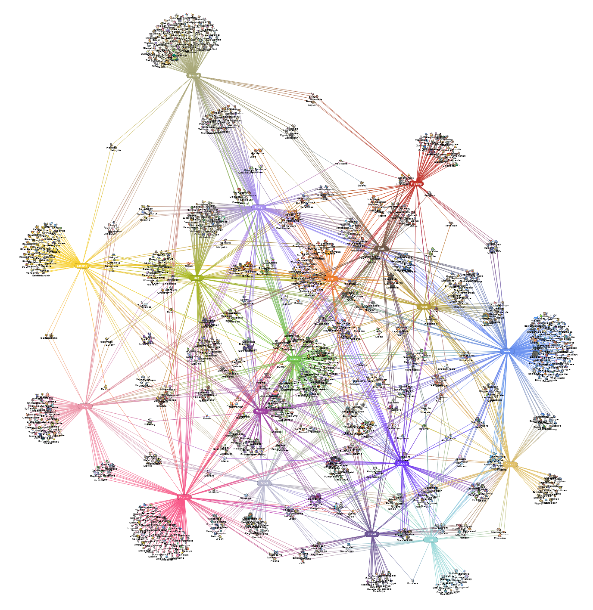

# Pokemon Type Network Graph
Interactive network graph visualizing Pokemons and their associated Types.

References:
- https://bulbapedia.bulbagarden.net/wiki/Type
- https://bulbapedia.bulbagarden.net/wiki/List_of_Pok%C3%A9mon_by_National_Pok%C3%A9dex_number
- https://bulbapedia.bulbagarden.net/wiki/Regional_form
- https://bulbapedia.bulbagarden.net/wiki/Mega_Evolution
- https://bulbapedia.bulbagarden.net/wiki/Primal_Reversion
- https://bulbapedia.bulbagarden.net/wiki/Bond_Phenomenon
- https://bulbapedia.bulbagarden.net/wiki/Ultra_Burst
- https://bulbapedia.bulbagarden.net/wiki/Gigantamax
- https://bulbapedia.bulbagarden.net/wiki/List_of_Pok%C3%A9mon_with_gender_differences
- https://bulbapedia.bulbagarden.net/wiki/List_of_Pok%C3%A9mon_with_form_differences
- https://archives.bulbagarden.net/wiki/Category:Generation_VIII_menu_sprites

## GitHub Pages
https://hyssopi.github.io/Pokemon-Type-Network-Graph/

## Prerequisites
- (To build) `npm` installed.

## Build
Run `npm run webpack`.

## Run
Open `index.html` in a web browser.

## Test
(None)
